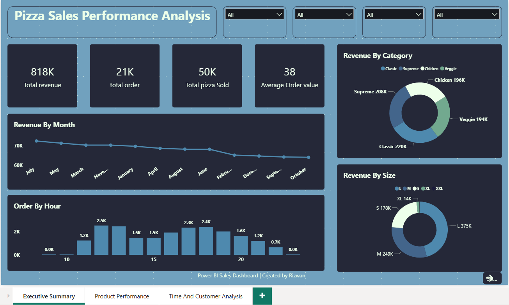
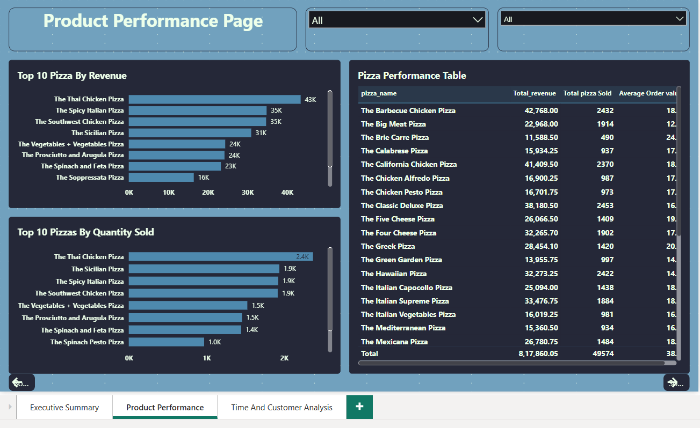
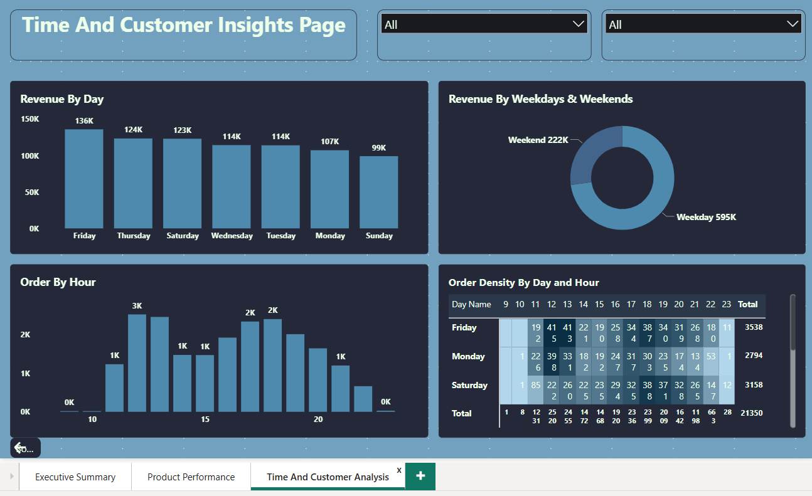

## 📊 Project Overview

This project presents an interactive Power BI dashboard to analyze pizza sales data. It helps in understanding revenue trends, customer behavior, and product performance.

## Key Metrics

-Total Revenue: 818K+
-Total Orders: 21K+
-Total Pizzas Sold: 50K+
-Average Order Value: 38

## Dashboard Features

🔹 Executive Summary

-Revenue by Month
-Revenue by Category
-Revenue by Size
-Orders by Hour

🔹 Product Performance

- Top 10 Pizzas by Revenue
- Top 10 Pizzas by Quantity Sold
- Detailed performance table

🔹 Time & Customer Insights
- Revenue by Day
- Weekday vs Weekend Analysis
- Order Density by Time

## Tools Used

- Power BI
- Data Analysis
- Data Visualization

## Dashboard Preview

